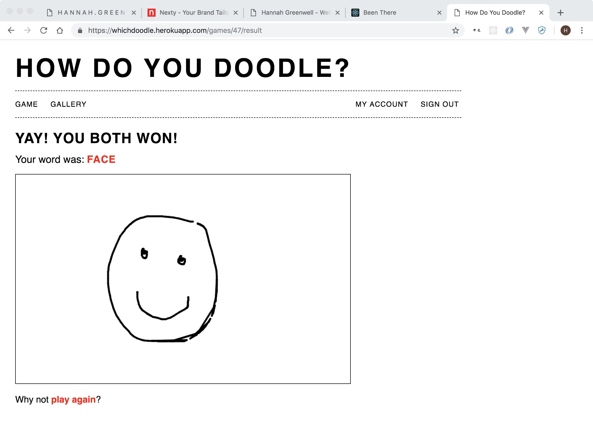

# Project#2: How Do You Doodle?

Skip the reading and go straight to a live version of the site here: [https://whichdoodle.herokuapp.com/](https://whichdoodle.herokuapp.com/)

### Description
An online, two-player drawing and guessing game (hmmm... sounds a bit like Pictionary). Player 1 is the drawer and can use either the mouse or a Leap Motion controller to create their artwork. Player 2, the guesser, can watch the drawer's sketch appear on their screen in real-time (thanks to the magic of WebSockets). A gallery of How Do You Doodle? artworks is also included for players and passers-by to check out.

### Features
- Create your very own How Do You Doodle? account
- Drawers can sketch with either the mouse or Leap Motion controller
- Guessers can watch the drawer's sketch appear on their screen in real-time
- Check out previous games' artworks on the gallery page

### Built With
- HTML/CSS
- HTML5 Canvas
- JavaScript
- jQuery
- AJAX
- Ruby on Rails
- WebSockets using ActionCable
- Leap Motion controls with Leap.js

### Gems & APIs
- Redis
- bcrypt
- Cloudinary

### Known Bugs
- No error handling for games where a player leaves
- The timer can be restarted if a player refreshes the browser
- Blank images appear in the gallery

### To Do
- Handle games where a player leaves before it's finished
- Show a drawing's details in the gallery
- Allow users to add their own words
- TESTING!

### Screenshot

